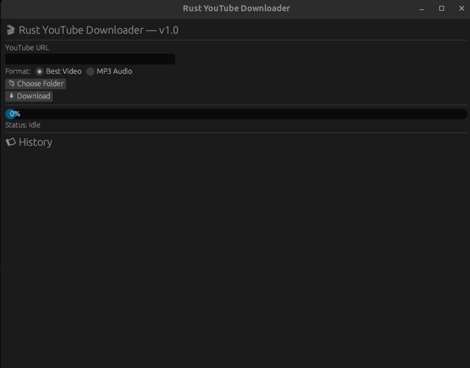

# Rstube

**Rstube** is a Rust-based YouTube video downloader with a GUI using egui/eframe.
It allows you to download videos directly from YouTube, supporting both video and audio streams. This first version is a single-file Rust project (`main.rs`) using `yt-dlp` for fetching and downloading content.

---

## Features (v0.1)

- Download individual YouTube videos by URL
- Async downloads using Rust + Tokio
- GUI: egui/eframe
- Progress bar
- History report
- format select
- folder picker
- clean architecture


---

## Requirements

- Rust (latest stable)
- `yt-dlp` installed and accessible in your system PATH
- `ffmpeg` installed (optional, needed for merging video + audio streams)

---

## Install

```
git clone https://github.com/Abdoelabassi/rstube.git
cd rstube
cargo build --release

```
---

Full release for Windows, MacoOS soon...

---

## Screenshots

## Screenshot

Here’s a screenshot of Rstube app:



